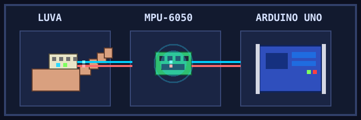

# SenseGlove_ExpoSE-2025

## Visão geral visual

  

Projeto de luva instrumentada com sensor MPU-6050 e ESP32 para interpretar dados de movimento e convertê-los em comandos de teclas.

Descrição original: Luva instrumentada com um sensor MPU-6050 e uma ESP32 que interpreta os dados coletados pelo sensor e enviados para o microcontrolador e traduzido para comandos de teclas.
